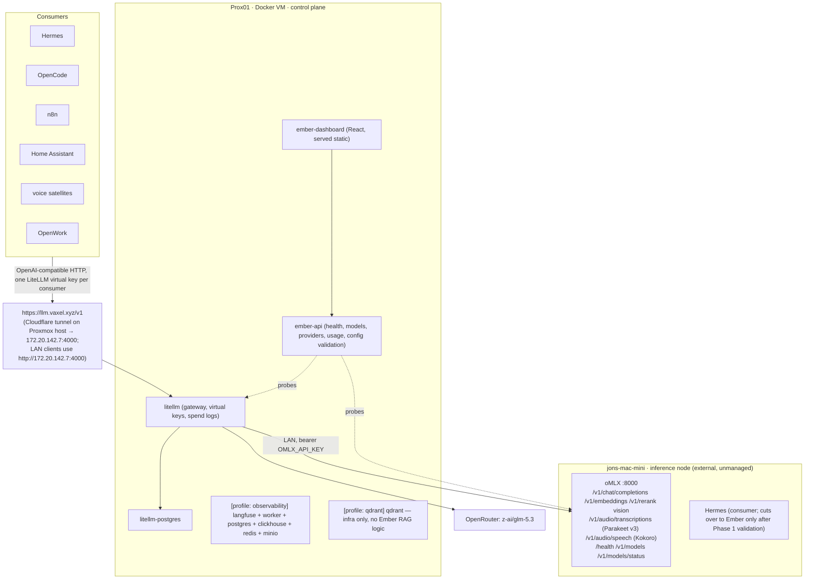

# Architecture

Governing principle: Prox01 (the Docker VM) owns durable state, routing and control. The mini
(`jons-mac-mini`) owns accelerated execution. If the mini is off, LiteLLM, ember-api, the
dashboard, Langfuse and Qdrant stay up; oMLX-backed aliases report `unreachable`, not the
platform.

## System diagram



## Components

### LiteLLM gateway (`litellm`)

`ghcr.io/berriai/litellm:v1.81.3-stable`, backed by its own Postgres (`litellm-postgres`) for
virtual keys and spend logs. Config is rendered at container start from
`config/litellm/ember.yaml.tmpl` by `config/litellm/render-config.py` — a single file, no ODS
mode files, no switchboard, no model-router. Each consumer gets its own virtual key with
`metadata.client=<name>`; the dashboard's Clients view derives from `/spend/logs` and
`/key/info`, so no bespoke per-consumer integration is needed. `LLM_INTERNAL_URL`
(`http://172.20.142.7:4000/v1`) and `LLM_PUBLIC_URL` (`https://llm.vaxel.xyz/v1`) are both
surfaced by ember-api/dashboard; LAN consumers such as Hermes use the internal one. See
[`docs/litellm.md`](litellm.md).

### ember-api

Thin FastAPI service (`ember-api/ember_api/`, ~470 lines), replacing ODS `dashboard-api`
(20.8k lines) and `ods-host-agent.py` (12.8k lines). No Docker socket, no host agent, no GPU
detection, no GGUF directory, no magic-link auth — a single `EMBER_API_KEY` bearer secures
every route. Endpoints:

| Route | Source | Purpose |
|---|---|---|
| `GET /api/health` | self | liveness |
| `GET /api/services` | manifests + HTTP probes, 15 s poll loop | per-service state machine |
| `GET /api/nodes` | manifests | control-plane vs inference-node grouping |
| `GET /api/models` | oMLX `/v1/models/status` + alias env vars | alias → provider → model → resident → size |
| `GET /api/capabilities` | derived from oMLX health + env | llm/vision/embed/rerank/stt/tts availability |
| `GET /api/providers` | config + env presence | oMLX, OpenRouter configured/reachable, no secrets echoed |
| `GET /api/config/validate` | config | same checks as `ember doctor` |
| `POST /api/services/refresh` | manifests + HTTP probes | force a shallow re-poll now |
| `POST /api/services/refresh?deep=true` | LiteLLM `GET /health` | on-demand deep gateway check (one live call per deployment) |

### Service manifests

Registry is a static directory: `services/<id>/manifest.yaml`, validated against
`services/schema/service-manifest.v1.json` (extended with `x_ember` and `type: external`).
Services in Phase 1: `litellm`, `litellm-postgres`, `ember-api`, `ember-dashboard`, `omlx`
(external); profile-gated: `qdrant` (and `langfuse*` from Phase 3). Example (`omlx`):

```yaml
service:
  id: omlx
  name: oMLX
  host_env: OMLX_HOST
  port: 8000
  health: /health
  type: external
  x_ember:
    node: jons-mac-mini
    role: inference
    managed: false
    capabilities: [llm, vision, embeddings, rerank, stt, tts]
    health_probe: omlx
```

### Health state machine

Every service resolves to one of five states — never green on TCP alone:

| State | Meaning |
|---|---|
| `healthy` | reachable and functional |
| `degraded` | reachable, HTTP 200, but not functional — oMLX `loaded_count == 0`; for the gateway, readiness is fine but `/model/info` is unavailable or is missing published aliases (i.e. an alias is not routable at all). A gateway that can route every alias is `healthy` even if a deep check later reports individual deployments unhealthy — those are listed in the deep check's `unhealthy_endpoints`, not held against the gateway's state. |
| `starting` | oMLX 503 with `status: loading` |
| `reachable-unhealthy` | HTTP ≥ 400 outside the defined states |
| `unreachable` | connect failure, DNS failure, or timeout |

oMLX probe: `GET /health` (no auth) → parses `status`, `engine_pool.loaded_count`,
`current_model_memory`, `final_ceiling`.

LiteLLM probe (shallow, poll loop): `GET /health/readiness` (unauthenticated) then
`GET /model/info` with the master key, comparing the returned `model_name`s against the
alias set in `ember-api/ember_api/aliases.py`. Neither call triggers inference. States:
`unreachable` on transport error or timeout, `reachable-unhealthy` on readiness ≥ 400,
`degraded` when `/model/info` fails or is missing aliases, `healthy` otherwise with
`detail = {aliases_registered, aliases_expected, missing}`.

Lesson from the Phase 1 final review (C1): a health probe that performs inference is not a
health probe — polling LiteLLM `GET /health` every 15 s fired ~10 requests at the mini every
~30 s, evicting resident models to admit a larger one (~300 evictions/hour, 676 failed
completions) and reporting the node `unreachable` while it was up.

LiteLLM's `GET /health` is a **deep** check — it performs a live call per deployment — so it
is never in the poll loop. Run it on demand with
`POST /api/services/refresh?deep=true` (same bearer as every other route), which returns
LiteLLM's healthy/unhealthy endpoint lists, or with `bin/ember doctor`, which makes real
`ember-auto` and `ember-embed` calls. See `ember-api/ember_api/health.py`.

### ember-dashboard

React/Vite/Tailwind, reusing the ODS scaffold (theme context, layout, sidebar pattern).
`ODSTalk`, `FirstBoot`, `Invites`, `RemoteProvider`, `Extensions`, `GPUMonitor` and the plugin
registry are deleted. Pages: Overview (control-plane vs inference-node columns, state badges,
capabilities grid), Models (alias table + oMLX resident models), Providers (oMLX/OpenRouter
configured/reachable, gateway URLs), Settings (theme + `ember doctor`-equivalent config
checks).

### Qdrant (profile `qdrant`)

Hosted for operational convenience only. ember-api shows health; there is no collection,
ingestion, retrieval or embedding orchestration in Ember. Hermes owns all RAG behaviour and
calls `ember-embed` itself.

### `bin/ember` CLI

`ember up|down|restart|status|logs [service]|doctor|keys create <client> [--budget USD]`.
`doctor` validates required `.env` variables, that `docker compose config` renders, that
Qdrant (if running) has a real API key, oMLX reachability + `/health` parsing, LiteLLM
readiness, a real `ember-auto` completion, and an `ember-embed` vector — exiting non-zero on
any failure with a plain reason. See [`docs/troubleshooting.md`](troubleshooting.md).

## Failure behaviour

| Failure | Result |
|---|---|
| mini off | control plane stays up; `omlx` reports `unreachable`; oMLX-backed aliases return LiteLLM 5xx with a clear backend error; `ember-think` still works |
| oMLX up, no model loaded | oMLX reports `degraded`; first request triggers on-demand load (oMLX LRU); dashboard shows `loaded_count` |
| Docker VM off | Ember is unavailable; Hermes may still hit oMLX directly until cutover — after cutover, rollback is documented in [`docs/hermes-cutover.md`](hermes-cutover.md) |
| Internet off | local aliases work on the LAN URL; the cloud alias (`ember-think`) fails; the Cloudflare path is down |
| Langfuse down (Phase 3+) | LiteLLM continues — callback failures are non-blocking; dashboard shows Langfuse unhealthy |
